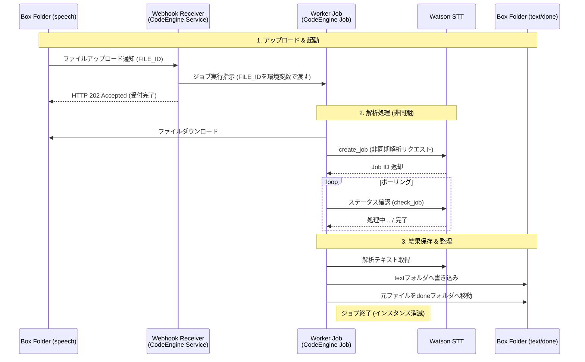

# stt-box 構築ガイド

Boxにアップロードされた音声ファイルを、IBM Cloud CodeEngine と Watson Speech to Text (STT) を利用して自動でテキスト化するサーバーレス・パイプラインの構築手順です。

## 1. 概要

特定のBoxフォルダに音声ファイルが保存されると、Webhookを介してCodeEngine（Receiver）が起動し、解析用Worker Jobをバックグラウンドでキックします。解析完了後、テキストをBoxへ保存し、元の音声ファイルを整理用フォルダに移動します。

## 2. システムアーキテクチャ



## 3. 作業の前提条件

本手順を開始する前に、以下のリソースがプロビジョニング済みであることを確認してください。

1. **IBM Cloud Watson Speech to Text**: サービスインスタンスが作成されていること。
2. **IBM Cloud CodeEngine**: プロジェクトが作成済みであること。
3. **IBM Cloud Container Registry**: 名前空間（Namespace）が作成済みであること。
4. **Box アカウント**: 開発者コンソールおよび管理コンソールへのアクセス権限があること。
5. **ローカル環境**:
   * **Docker**: イメージのビルドに必要です。インストールは[Docker Desktop](https://www.docker.com/products/docker-desktop/)などを参照してください。
   * **IBM Cloud CLI**: インストールは[公式ガイド](https://cloud.ibm.com/docs/cli?topic=cli-install-ibmcloud-cli)を参照してください。

## 4. 詳細構築手順

### STEP 1: ローカル環境の準備

1. 本リポジトリをクローンします。
2. `env.sample` をコピーして `.env` ファイルを作成します。以降の手順で取得する値は、この `.env` の該当項目に順次貼り付けてください。

### STEP 2: Watson STT 資格情報の取得

1. IBM Cloud コンソールで Watson Speech to Text インスタンスを開きます。
2. 左メニュー「管理」から **API キー** をコピーし、`.env` の `STT_API_KEY` に貼り付けます。
3. 同画面の **URL** をコピーし、`.env` の `STT_SERVICE_URL` に貼り付けます。

### STEP 3: Box フォルダの作成と権限設定

1. Box ユーザー画面で、本システム用の親フォルダ（例: `box-stt-root`）を作成します。
2. 親フォルダの中に、以下の 3 つの子フォルダを作成します。
   * `speech`（音声投入用）
   * `text`（テキスト出力用）
   * `done`（処理済み移動用）
3. 各フォルダを開き、ブラウザの URL 末尾にある数字（フォルダ ID:../folder/nnnnnnnnnnnn）をコピーして、`.env` の `BOX_SPEECH_FOLDER_ID`, `BOX_TEXT_FOLDER_ID`, `BOX_DONE_FOLDER_ID` にそれぞれ貼り付けます。

### STEP 4: Box Platform アプリケーションの定義

1. **アプリ作成**: [Box開発者コンソール](https://app.box.com/developers/console)で「Platformアプリの作成」を選択。
   * **アプリ名**: 任意のアプリケーション名（例: `box-stt`）
   * **認証方法**: アプリの種類で「クライアント資格情報許可 (Client Credentials Grant)」を選択。
2. **基本情報取得**: 「構成」タブで以下を確認します。
   * **クライアント ID**: コピーし、`.env` の `BOX_CLIENT_ID` へ貼り付けます。
   * **クライアントシークレット**: 「クライアントシークレットを取得」で得られた文字列をコピーし、`.env` の `BOX_CLIENT_SECRET` へ貼り付けます。
3. **アプリケーションスコープ**: 以下にチェックを入れます。
   * `Boxに格納されているすべてのファイルとフォルダへの書き込み`
   * `Webhook管理する`
4. **エンタープライズID取得**: 「一般設定」タブで以下を確認します。
   * **Enterprise ID**: 画面下部から確認し、`.env` の `BOX_ENTERPRISE_ID` へ貼り付けます。
5. **承認依頼**: 「承認」タブで以下を確認します。
   * **「確認して承認」**: ボタンを押し管理者に承認依頼する。
7. **親フォルダへの招待**:
   * アプリの「一般設定」タブにある **「サービスアカウント情報」** の **Service Account ID**（自動生成されたメールアドレス形式のもの）をコピーします。
   * Box ユーザー画面に戻り、STEP 3 で作成した **親フォルダ** の **「共有」** ポップアップの **ユーザーを招待** に、このサービスアカウントを「編集者」として招待します。
8. **アプリの承認**:
   * Box 管理コンソール > 統合 > Platformアプリマネージャ > サーバー認証アプリの「・・・」から「アプリの（再）承認」を選び本アプリを承認します。

### STEP 5: コンテナイメージのビルドとプッシュ

1. **CLIへのログイン**:
   * IBM Cloud コンソール右上のアバターをクリックし、「CLI と API にログイン」を選択する。
   * 表示されたログインコマンドをコピーし、ターミナルで実行する。
   * リージョンの選択にて、IBM Cloud Container Registryが稼働するリージョンを選択する。
2. **プラグインの確認**:
   Container Registry 操作用のプラグインが未導入の場合は、下記コマンドでインストールしてください。
   ```bash
   ibmcloud plugin install container-registry
   ```
3. **名前空間の確認（または作成）**
   ```bash
   # 既存の名前空間の確認
   ibmcloud cr namespaces
   # 名前空間の作成（未作成の場合のみ）
   ibmcloud cr namespace-add <名前空間名>
   ```
4. `Dockerfile` を使用してイメージをビルドします。
   * Container Registryのドメインと名前空間を使用して`docker`コマンドを実行する。
   * CRドメイン: jp-tokの場合 `jp.icr.io`、en-southの場合 `icr.io` を使用する。
   ```bash
   ibmcloud cr login
   docker build -t [CRドメイン]/[名前空間名]/stt-box-wxo:latest .
   docker push [CRドメイン]/[名前空間名]/stt-box-wxo:latest
   ```

### STEP 6: CodeEngine への展開

1. **レジストリー・アクセスの作成**:
* CodeEngine プロジェクト内「プロジェクトの詳細」>「レジストリー・アクセス」から、Container Registry の名前空間にアクセスするためのシークレット（例: `icr-secret`）を作成します。
2. **Secret (機密情報) の作成**:
* 「機密情報と構成マップ」 > 「作成」 > 「秘密」を選択。
* 名前を `stt-secrets` とし、`.env` の全内容を Key-Value 形式で登録します。
3. **Receiver (App) の作成**:
* 「アプリケーション」 > 「作成」。
* **イメージ**: プッシュしたイメージを選択。レジストリー・アクセスに `icr-secret` を指定。
* **ポート**: `8080` (デフォルト)。
* **実行コマンド**: ブランク（DockerfileのCMDを使用）。
* **環境変数**: `stt-secrets` をすべて参照設定します。
* 作成完了後、**パブリックURL** を控えます。
4. **Worker (Job) の作成**:
* 「ジョブ」 > 「作成」。
* **イメージ**: 同イメージを選択。
* **コマンドの上書き**: 実行コマンドを `python`、引数を `ce_worker.py` に指定。
* **環境変数**: `stt-secrets` をすべて参照設定します。

### STEP 7: Webhook V2 の紐付け

1. Box 開発者コンソール > Webhook > Webhookの作成。
* **対象**: `speech` フォルダを選択。
* **イベント**: `FILE.UPLOADED`
* **ターゲット URL**: STEP 6 で取得した Receiver App の URL。


## 5. (オプション) ローカルでの開発・デバッグ
ローカル環境でスクリプトを直接実行してテストを行う場合は、以下の手順で環境を構築してください。
1. **仮想環境の作成**:
```bash
python -m venv venv
source venv/bin/activate  # Windowsの場合は venv\Scripts\activate
```
2. **ライブラリのインストール**:
```bash
pip install -r requirements.txt
```   
3. **実行**:`.env` がカレントディレクトリにある状態で実行します。

## 6. リポジトリ構成

* `ce_receiver.py`: Webhook受信、Jobキック。
* `ce_worker.py`: 音声解析、Box操作。
* `ce_utils.py`: ログ基盤。
* `Dockerfile`: 共通実行環境。
* `env.sample`: 環境変数のテンプレート。
